[README.md](https://github.com/user-attachments/files/22084069/README.md)
# linux

<a href="0252.jpg">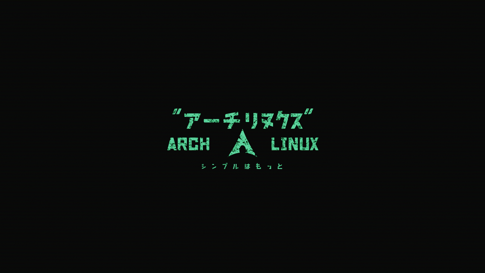</a>

<a href="0393.jpg">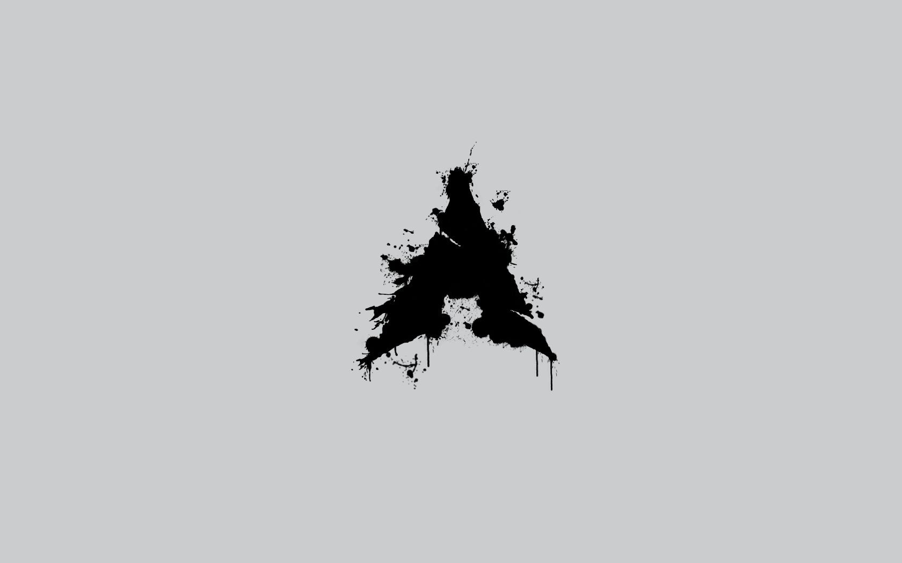</a>

<a href="5962457c8bd780d9.png">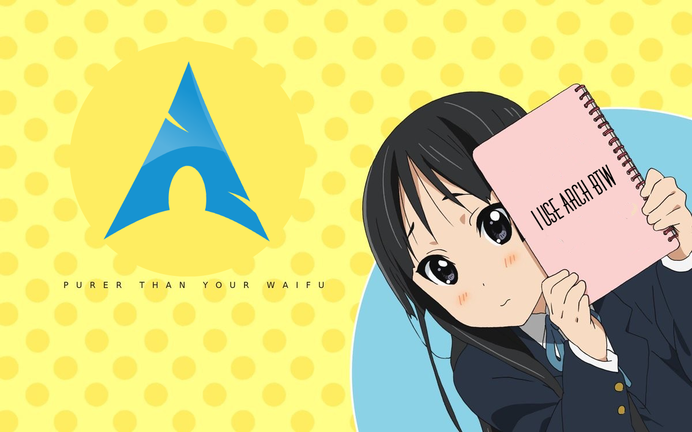</a>

<a href="Debian.png">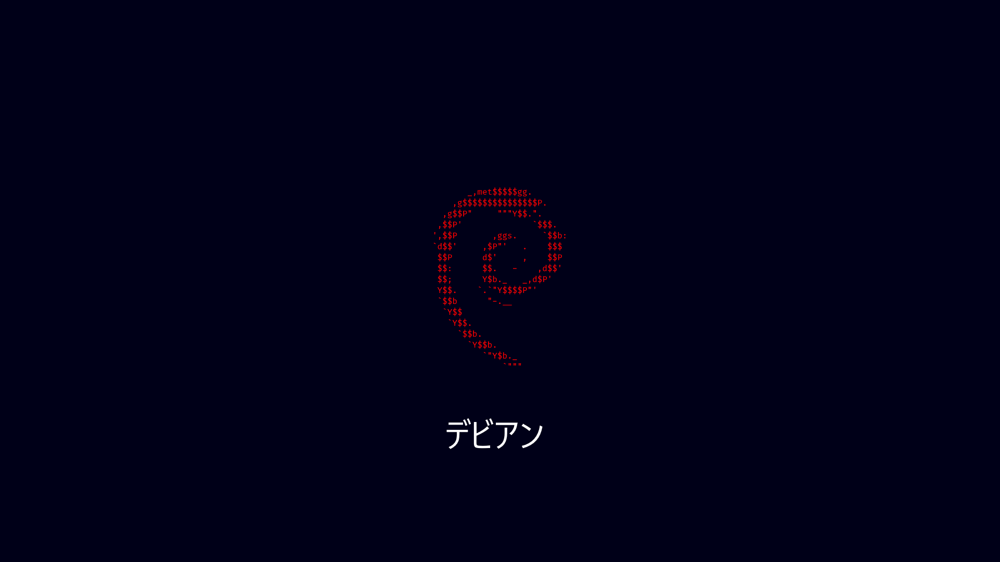</a>

<a href="Group_80.png">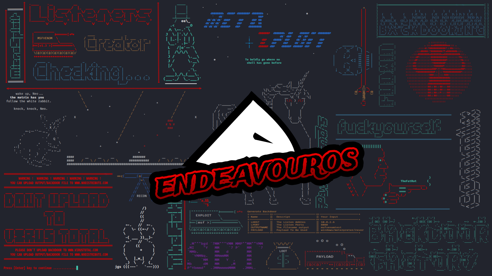</a>

<a href="LinuxWallpaper1.jpg">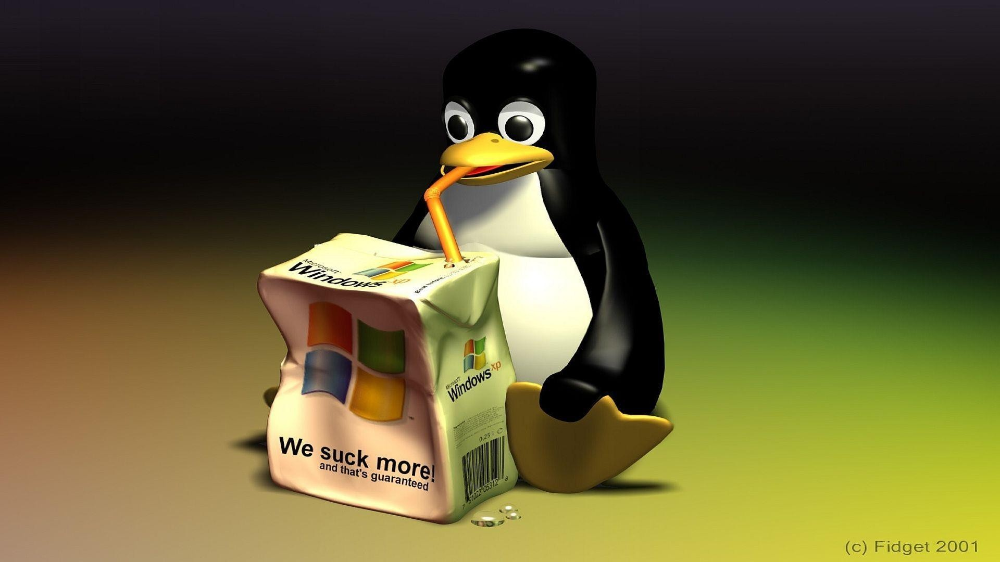</a>

<a href="New_Project.png">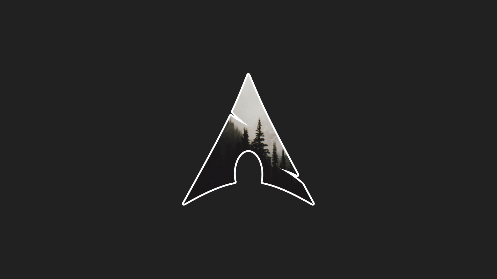</a>

<a href="NixOS-Outline.png">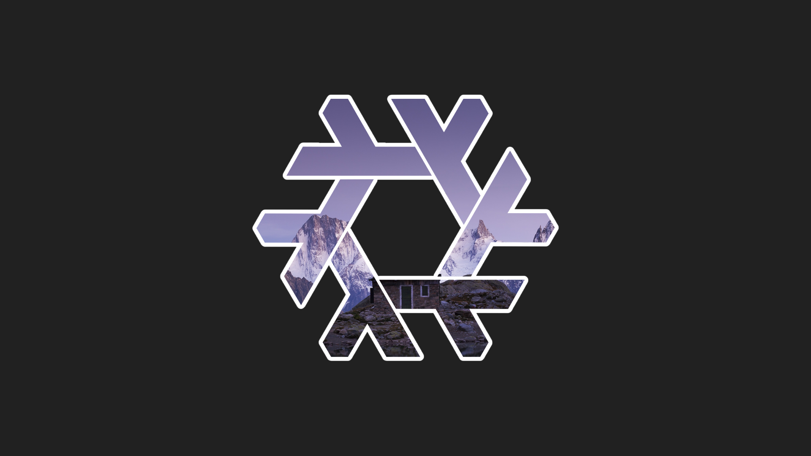</a>

<a href="The_Dark_Side_4K.png">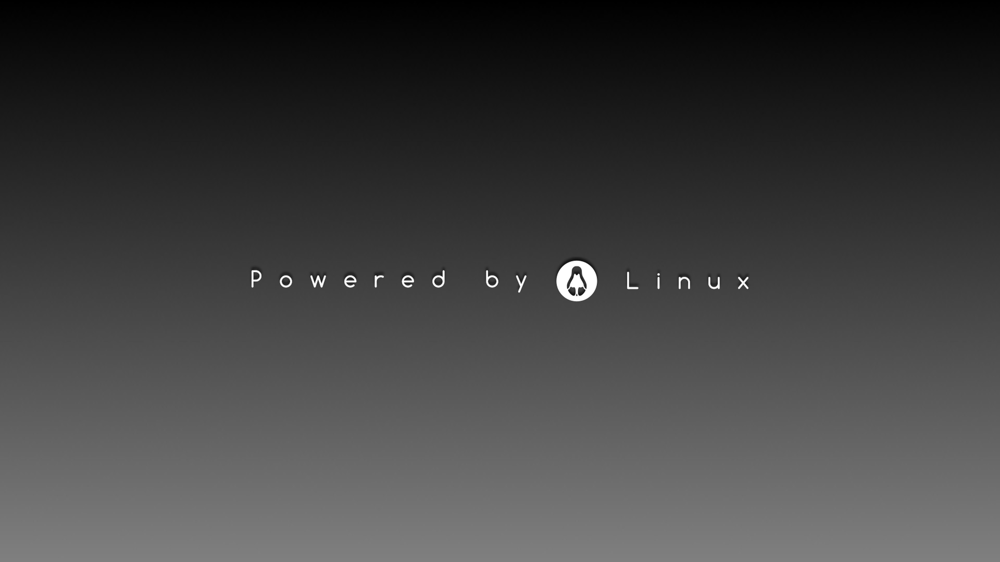</a>

<a href="TuxGruvbox.png">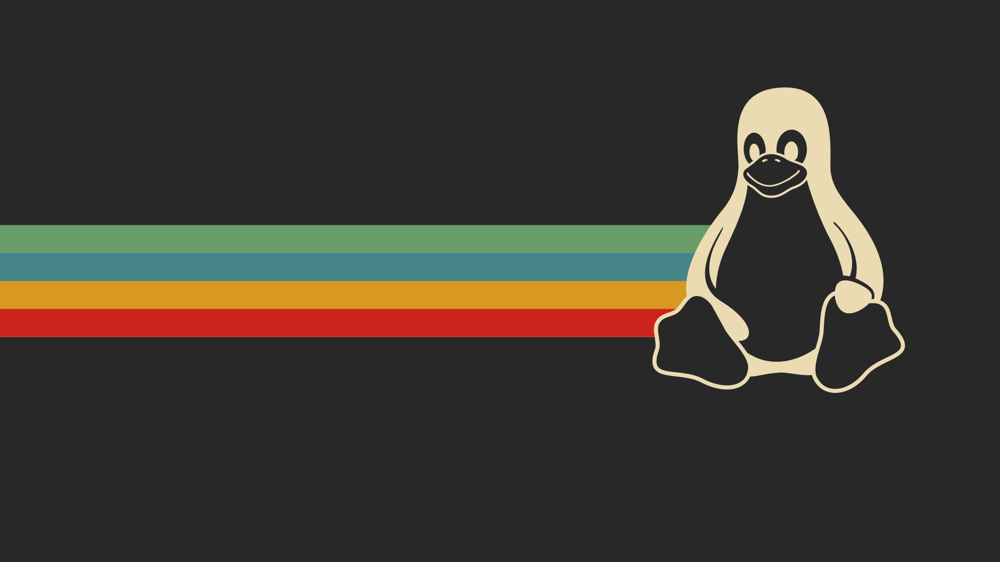</a>

<a href="archWithAnotherWaifu.jpg">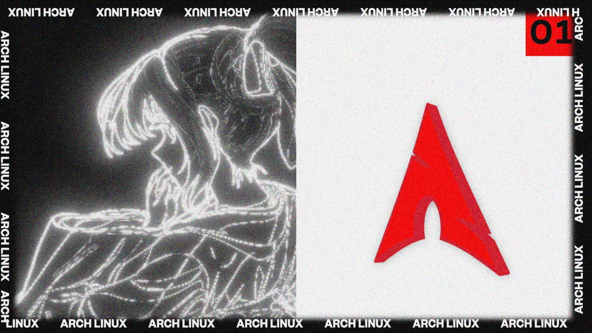</a>

<a href="archgradient.png">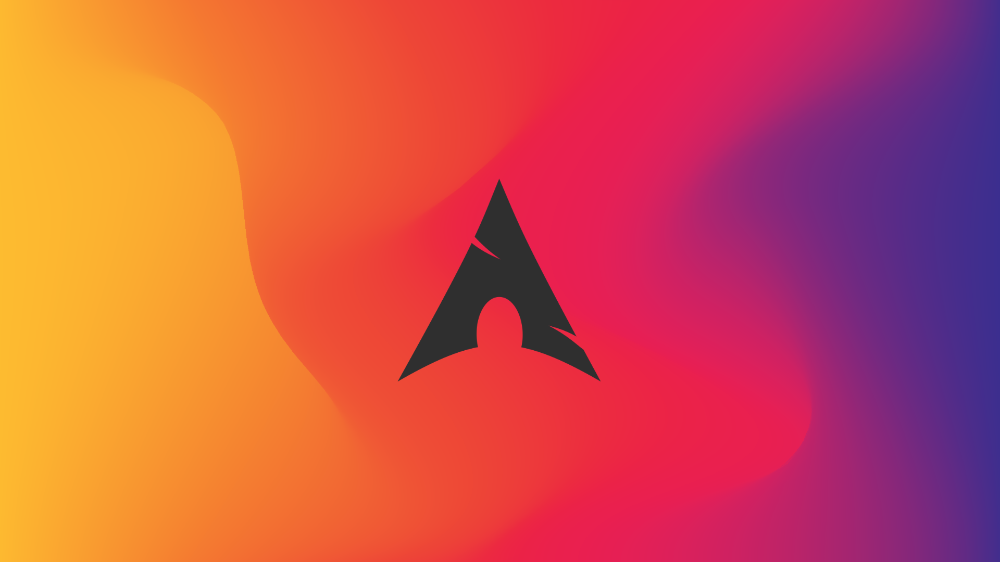</a>

<a href="catpuccin_3840_2160.png">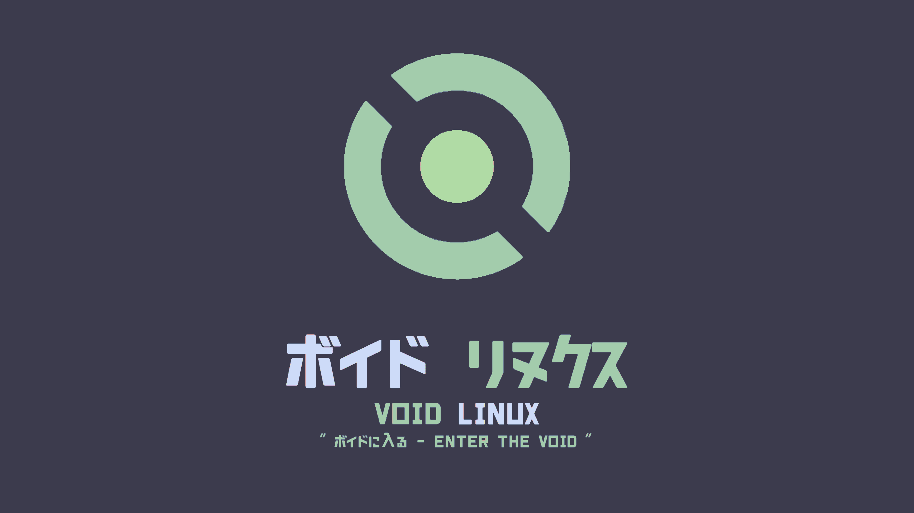</a>

<a href="crux.png">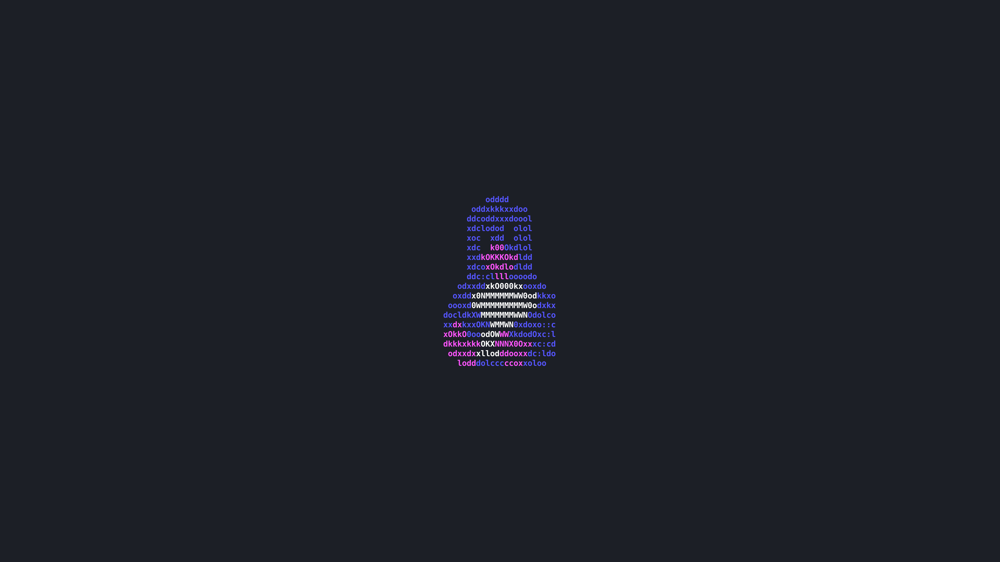</a>

<a href="image0.jpg">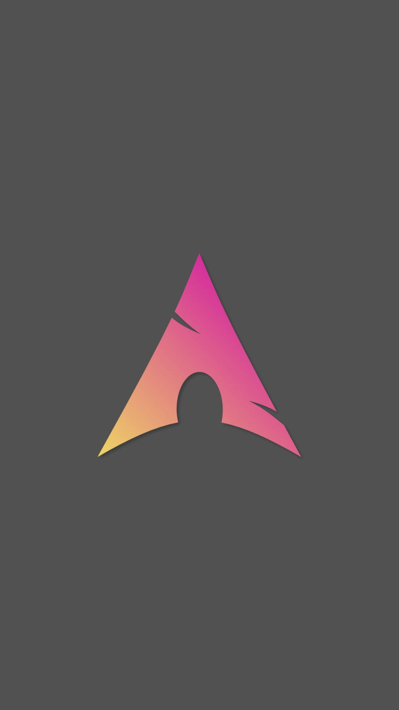</a>

<a href="qyqj7y34hlp31.jpeg">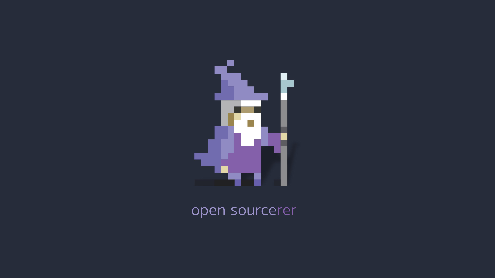</a>

<a href="welcum.png">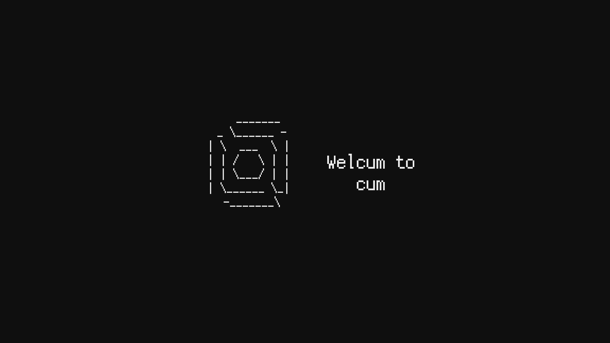</a>

